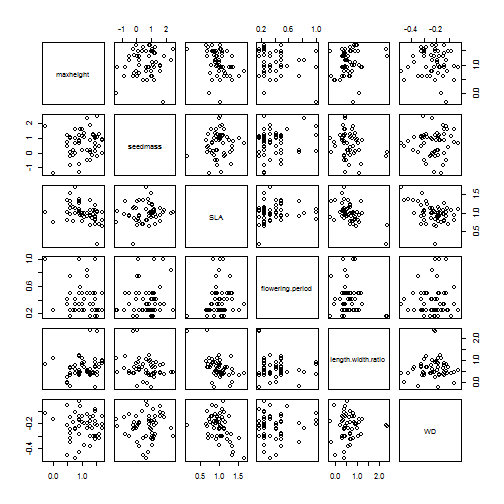
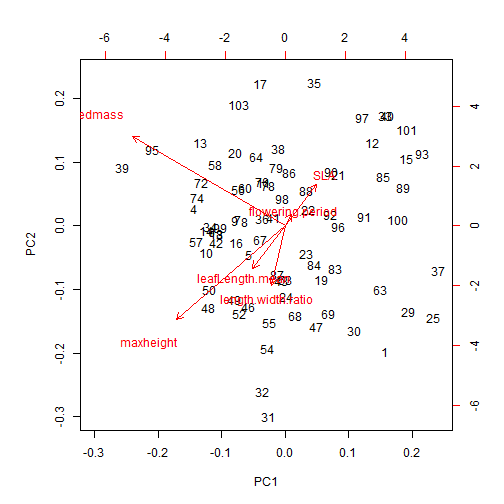
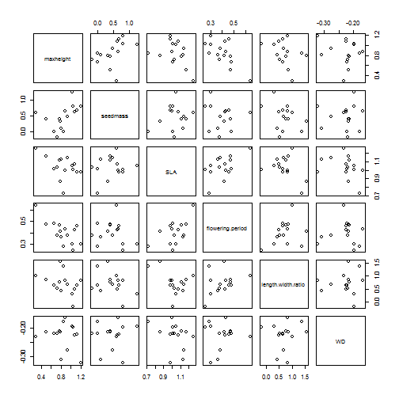
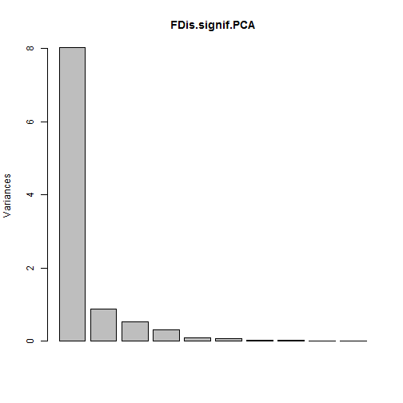
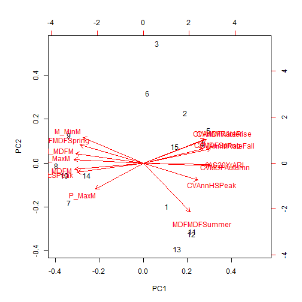
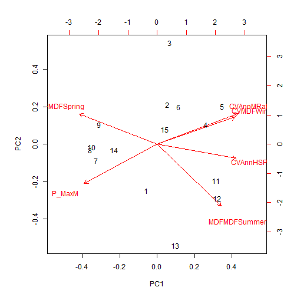

Functional Diversity of riparian plant communities of south eastern Australia 
========================================================

This document presents the results of a functional diversity analysis using the following traits:

maxheight
SLA
seedmass
wood density
flowering period (proportion of year)
leaf length:width ratio
(leaf length)

Species by species trait correlations
--------------------------------------
Missing wood density cors due to missing values


```r
traits.naomit <- na.omit(traits)
pairs(traits.naomit)
```

 

```r
cor(traits.naomit)
```

```
##                    maxheight seedmass     SLA flowering.period
## maxheight             1.0000  0.11679 -0.3766         -0.18770
## seedmass              0.1168  1.00000  0.1165          0.16079
## SLA                  -0.3766  0.11652  1.0000          0.15174
## flowering.period     -0.1877  0.16079  0.1517          1.00000
## length.width.ratio    0.2076 -0.22689 -0.5312         -0.11641
## WD                   -0.1059  0.04015 -0.4354          0.03592
##                    length.width.ratio       WD
## maxheight                     0.20762 -0.10591
## seedmass                     -0.22689  0.04015
## SLA                          -0.53118 -0.43544
## flowering.period             -0.11641  0.03592
## length.width.ratio            1.00000  0.07723
## WD                            0.07723  1.00000
```


PCA of trait data 
--------------------------------------

```r
traits.PCA <- prcomp(traits.all, centre=TRUE, retx=TRUE)
summary(traits.PCA)
```

```
## Importance of components:
##                          PC1   PC2    PC3    PC4    PC5    PC6
## Standard deviation     0.898 0.716 0.3863 0.2811 0.1996 0.1859
## Proportion of Variance 0.497 0.316 0.0921 0.0488 0.0246 0.0213
## Cumulative Proportion  0.497 0.813 0.9053 0.9541 0.9787 1.0000
```

```r
biplot(traits.PCA)
```

 


Trait correlations by CWM
--------------------------------------


```r
pairs(CWM)
```

 

```r
cor(CWM)
```

```
##                    maxheight seedmass     SLA flowering.period
## maxheight             1.0000   0.4390 -0.4226         -0.70122
## seedmass              0.4390   1.0000  0.2095         -0.13660
## SLA                  -0.4226   0.2095  1.0000          0.55707
## flowering.period     -0.7012  -0.1366  0.5571          1.00000
## length.width.ratio   -0.3423  -0.3442 -0.3928          0.32308
## WD                   -0.1660   0.0384 -0.3433          0.05575
##                    length.width.ratio       WD
## maxheight                     -0.3423 -0.16604
## seedmass                      -0.3442  0.03840
## SLA                           -0.3928 -0.34328
## flowering.period               0.3231  0.05575
## length.width.ratio             1.0000  0.09990
## WD                             0.0999  1.00000
```


FDis significant regressions
--------------------------------------

```r
getStats(hydroplots, hydroplots$FDis)
```

```
## Warning: ANOVA F-tests on an essentially perfect fit are unreliable
## Warning: ANOVA F-tests on an essentially perfect fit are unreliable
```

```
##                  metric pval.linear r2.linear  pval.quad r2.quad
## 1         leafratio.CWM   1.717e-02    0.3645  2.114e-02  0.3777
## 2  flowering.period.CWM   1.994e-02    0.3511  2.514e-02  0.3556
## 3         maxheight.CWM   9.993e-03    0.4111  1.300e-02  0.4188
## 4                  RaoQ   1.168e-12    0.9816  2.782e-14  0.9930
## 5                  FRic   2.418e-03    0.5199  3.259e-03  0.5345
## 6                  FDiv   4.735e-02    0.2695  5.625e-02  0.2755
## 7                  FDis  3.656e-206    1.0000 8.853e-191  1.0000
## 8           CVMDFWinter   8.691e-03    0.4227  1.140e-02  0.4304
## 9          MDFMDFSummer   3.528e-03    0.4928  4.821e-03  0.5026
## 10         MDFMDFSpring   1.169e-02    0.3979  1.493e-02  0.4075
## 11               M_MaxM   3.947e-02    0.2872  4.808e-02  0.2883
## 12               P_MaxM   6.359e-03    0.4479  1.747e-03  0.6648
## 13               M_MinM   3.897e-02    0.2885  2.459e-02  0.4755
## 14               M_MDFM   3.628e-02    0.2953  4.095e-02  0.3240
## 15            AS20YrARI   2.492e-02    0.3307  3.070e-02  0.3379
## 16       CVAnnMRateFall   2.649e-02    0.3250  3.319e-02  0.3260
## 17       CVAnnMRateRise   1.041e-02    0.4077  1.381e-02  0.4105
## 18          CVAnnHSPeak   1.223e-03    0.5655  1.760e-03  0.5760
##    padj.linear  padj.quad
## 1    5.619e-02  6.918e-02
## 2    5.981e-02  6.962e-02
## 3    4.164e-02  5.375e-02
## 4    2.102e-11  5.007e-13
## 5    2.176e-02  2.347e-02
## 6    9.469e-02  1.125e-01
## 7   1.316e-204 3.187e-189
## 8    4.164e-02  5.375e-02
## 9    2.540e-02  2.892e-02
## 10   4.208e-02  5.375e-02
## 11   8.359e-02  1.018e-01
## 12   3.815e-02  1.584e-02
## 13   8.359e-02  6.962e-02
## 14   8.359e-02  9.214e-02
## 15   6.813e-02  7.893e-02
## 16   6.813e-02  7.965e-02
## 17   4.164e-02  5.375e-02
## 18   1.468e-02  1.584e-02
```

PCA over significant hydrological variables
-------------------------------------------

```r
FDis.signif <- data.frame(cbind(
                          "CVMDFWinter" = hydro$CVMDFWinter,
                          "MDFMDFSummer" = hydro$MDFMDFSummer,
                          "MDFMDFSpring" = hydro$MDFMDFSpring,
                          "P_MaxM" = hydro$P_MaxM,
                          "CVAnnMRateRise"= hydro$CVAnnMRateRise,
                          "CVAnnHSPeak"= hydro$CVAnnHSPeak))
                                                    
FDis.signif.cor <- cor(FDis.signif)
View(FDis.signif.cor )
pairs(FDis.signif)
```

 

```r
FDis.signif.PCA <- prcomp(FDis.signif, scale=TRUE, centre=TRUE, retx=TRUE)
summary(FDis.signif.PCA)
```

```
## Importance of components:
##                          PC1   PC2    PC3    PC4    PC5     PC6
## Standard deviation     2.050 1.000 0.7661 0.3251 0.2613 0.18983
## Proportion of Variance 0.701 0.167 0.0978 0.0176 0.0114 0.00601
## Cumulative Proportion  0.701 0.867 0.9650 0.9826 0.9940 1.00000
```

```r
plot(FDis.signif.PCA)
```

 

```r
biplot(FDis.signif.PCA)
```

 

