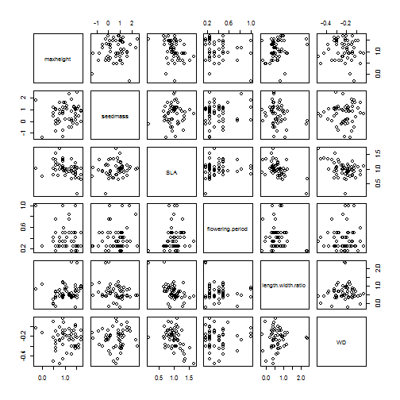
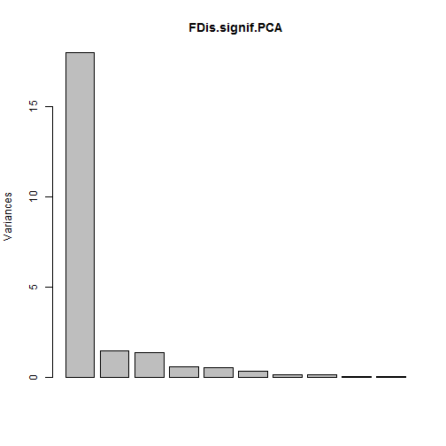
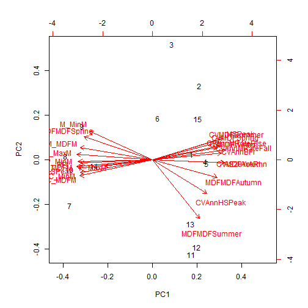

Functional Diversity of riparian plant communities of south eastern Australia 
========================================================

This document presents the results of a functional diversity analysis using the following traits:

- maxheight
- SLA
- seedmass
- wood density
- flowering period (proportion of year)
- leaf length:width ratio


**FDis and functional redundancy are significantly predicted by:**
- Flood magnitude (mean, extreme and CV)
- Low flow intensity
- Flood rise/fall rates
- Temporal uniformity of maximum, minimum and average flows (seasonal, interannual)
- Seasonality of flows


Relationships of hydrological variables with Functional Dispersion
------------------------------------------------------------------


```r
getStats(hydroplots, hydroplots$FDis, FD)
```

```
## Warning: essentially perfect fit: summary may be unreliable
## Warning: ANOVA F-tests on an essentially perfect fit are unreliable
## Warning: essentially perfect fit: summary may be unreliable
## Warning: ANOVA F-tests on an essentially perfect fit are unreliable
```

```
##            metric pval.linear r2.linear  pval.quad r2.quad padj.linear
## 1        richness   2.973e-02    0.3142  1.370e-02  0.5470   5.633e-02
## 2   maxheight.CWM   1.790e-02    0.3608  2.223e-02  0.3712   4.956e-02
## 3           redun   1.761e-03    0.5416  1.287e-03  0.6272   1.585e-02
## 4          FunRao   6.235e-03    0.4495  1.767e-04  0.8108   3.207e-02
## 5            RaoQ   2.446e-11    0.9706  2.540e-13  0.9900   4.403e-10
## 6            FRic   2.524e-02    0.3295  2.484e-02  0.3983   5.194e-02
## 7            FDiv   3.555e-02    0.2973  4.318e-02  0.3019   5.635e-02
## 8            FDis  9.432e-205    1.0000 1.401e-189  1.0000  3.396e-203
## 9              CV   3.140e-02    0.3091  3.571e-02  0.3370   5.635e-02
## 10    CVMDFWinter   9.625e-03    0.4143  1.279e-02  0.4178   4.331e-02
## 11    CVMDFAutumn   3.423e-02    0.3009  4.056e-02  0.3145   5.635e-02
## 12    CVMDFSpring   2.597e-02    0.3269  3.138e-02  0.3391   5.194e-02
## 13   MDFMDFSummer   3.061e-03    0.5032  4.492e-03  0.5033   2.204e-02
## 14   MDFMDFSpring   1.339e-02    0.3862  1.735e-02  0.3906   4.383e-02
## 15         M_MaxM   2.580e-02    0.3275  3.213e-02  0.3308   5.194e-02
## 16         P_MaxM   6.103e-03    0.4511  2.605e-03  0.6219   3.207e-02
## 17         M_MinM   2.397e-02    0.3342  1.205e-02  0.5404   5.194e-02
## 18         M_MDFM   2.086e-02    0.3470  2.075e-02  0.4120   5.194e-02
## 19      AS20YrARI   1.483e-02    0.3774  1.942e-02  0.3774   4.450e-02
## 20 CVAnnMRateFall   1.288e-02    0.3896  1.654e-02  0.3965   4.383e-02
## 21 CVAnnMRateRise   1.099e-02    0.4031  1.466e-02  0.4038   4.383e-02
## 22         LSPeak   4.334e-02    0.2782  5.224e-02  0.2808   6.501e-02
## 23    CVAnnHSPeak   1.014e-03    0.5773  1.393e-03  0.5941   1.217e-02
## 24     CVAnnHSNum   3.600e-02    0.2961  4.317e-02  0.3048   5.635e-02
##     padj.quad
## 1   4.798e-02
## 2   5.002e-02
## 3   1.003e-02
## 4   2.121e-03
## 5   4.573e-12
## 6   5.260e-02
## 7   6.758e-02
## 8  5.044e-188
## 9   6.427e-02
## 10  4.798e-02
## 11  6.758e-02
## 12  6.088e-02
## 13  2.310e-02
## 14  4.804e-02
## 15  6.088e-02
## 16  1.563e-02
## 17  4.798e-02
## 18  4.981e-02
## 19  4.981e-02
## 20  4.804e-02
## 21  4.798e-02
## 22  7.836e-02
## 23  1.003e-02
## 24  6.758e-02
```

Relationships of hydrological variables with Functional Richness
------------------------------------------------------------------


```r
getStats(hydroplots, hydroplots$FRic, FD)
```

```
## Warning: essentially perfect fit: summary may be unreliable
## Warning: ANOVA F-tests on an essentially perfect fit are unreliable
## Warning: essentially perfect fit: summary may be unreliable
## Warning: ANOVA F-tests on an essentially perfect fit are unreliable
```

```
##                  metric pval.linear r2.linear  pval.quad r2.quad
## 1              richness   1.083e-03    0.5732  2.001e-04  0.7517
## 2  flowering.period.CWM   1.383e-02    0.3835  1.734e-02  0.3952
## 3         maxheight.CWM   1.178e-02    0.3972  1.540e-02  0.4015
## 4                FunRao   2.667e-03    0.5130  2.837e-03  0.5592
## 5               simpson   2.109e-02    0.3460  1.492e-02  0.4850
## 6                  nbsp   4.783e-04    0.6217  3.259e-04  0.6978
## 7                  RaoQ   3.183e-02    0.3078  2.868e-02  0.4020
## 8                  FRic  3.390e-198    1.0000 2.342e-183  1.0000
## 9                  FDis   2.524e-02    0.3295  3.125e-02  0.3350
## 10               latinv   1.065e-02    0.4057  4.262e-03  0.6059
## 11            lattitude   1.065e-02    0.4057  4.262e-03  0.6059
## 12              climate   1.573e-02    0.3722  1.573e-02  0.3722
## 13         MDFMDFWinter   2.207e-03    0.5263  4.409e-05  0.8371
## 14         MDFMDFAutumn   4.316e-02    0.2786  4.176e-02  0.3564
## 15         MDFMDFSummer   2.530e-04    0.6558  1.014e-07  0.9375
## 16         MDFMDFSpring   2.284e-02    0.3387  9.136e-03  0.5779
## 17          CVAnnHSPeak   2.636e-02    0.3255  3.187e-02  0.3372
##    padj.linear  padj.quad
## 1    9.744e-03  1.801e-03
## 2    4.978e-02  4.801e-02
## 3    4.713e-02  4.720e-02
## 4    1.600e-02  1.702e-02
## 5    6.324e-02  4.720e-02
## 6    5.739e-03  2.347e-03
## 7    7.161e-02  7.171e-02
## 8   1.220e-196 8.432e-182
## 9    6.326e-02  7.171e-02
## 10   4.713e-02  1.918e-02
## 11   4.713e-02  1.918e-02
## 12   5.149e-02  4.720e-02
## 13   1.589e-02  5.290e-04
## 14   9.139e-02  8.843e-02
## 15   4.553e-03  1.824e-06
## 16   6.324e-02  3.654e-02
## 17   6.326e-02  7.171e-02
```

Relationships of hydrological variables with Functional Redundancy
------------------------------------------------------------------


```r
getStats(hydroplots, hydroplots$redun, FD)
```

```
## Warning: essentially perfect fit: summary may be unreliable
## Warning: ANOVA F-tests on an essentially perfect fit are unreliable
## Warning: essentially perfect fit: summary may be unreliable
## Warning: ANOVA F-tests on an essentially perfect fit are unreliable
```

```
##            metric pval.linear r2.linear  pval.quad r2.quad padj.linear
## 1           redun  2.774e-216    1.0000 2.684e-200  1.0000  9.985e-215
## 2         simpson   4.457e-02    0.2754  4.465e-02  0.3423   1.092e-01
## 3            RaoQ   3.377e-03    0.4960  4.526e-03  0.5092   4.053e-02
## 4            FDiv   1.931e-02    0.3539  1.503e-02  0.4716   8.691e-02
## 5            FDis   1.761e-03    0.5416  2.689e-03  0.5419   3.170e-02
## 6     CVMDFWinter   2.573e-02    0.3277  3.206e-02  0.3309   9.269e-02
## 7     CVMDFAutumn   2.672e-02    0.3242  2.530e-02  0.4033   9.269e-02
## 8     CVMDFSpring   1.728e-02    0.3639  1.793e-02  0.4183   8.691e-02
## 9          M_MaxM   4.551e-02    0.2734  5.486e-02  0.2747   1.092e-01
## 10         P_MaxM   5.959e-03    0.4530  8.040e-03  0.4597   5.363e-02
## 11         M_MDFM   3.090e-02    0.3106  3.615e-02  0.3299   9.269e-02
## 12      AS20YrARI   2.949e-02    0.3150  3.671e-02  0.3156   9.269e-02
## 13 CVAnnMRateFall   1.464e-02    0.3785  1.846e-02  0.3880   8.691e-02
## 14    CVAnnHSPeak   9.760e-03    0.4131  1.038e-02  0.4617   7.027e-02
## 15         HSPeak   3.818e-02    0.2904  4.476e-02  0.3057   1.057e-01
##     padj.quad
## 1  9.661e-199
## 2   1.151e-01
## 3   5.431e-02
## 4   8.308e-02
## 5   4.840e-02
## 6   1.101e-01
## 7   1.012e-01
## 8   8.308e-02
## 9   1.317e-01
## 10  7.236e-02
## 11  1.101e-01
## 12  1.101e-01
## 13  8.308e-02
## 14  7.473e-02
## 15  1.151e-01
```


Species by species trait correlations
--------------------------------------
Missing wood density cors due to missing values


```r
traits.naomit <- na.omit(traits)
cor(traits.naomit)
```

```
##                    maxheight seedmass     SLA flowering.period
## maxheight            1.00000  0.15627 -0.3701         -0.19589
## seedmass             0.15627  1.00000  0.1165          0.16079
## SLA                 -0.37009  0.11652  1.0000          0.15174
## flowering.period    -0.19589  0.16079  0.1517          1.00000
## length.width.ratio   0.19285 -0.22689 -0.5312         -0.11641
## WD                  -0.08565  0.04015 -0.4354          0.03592
##                    length.width.ratio       WD
## maxheight                     0.19285 -0.08565
## seedmass                     -0.22689  0.04015
## SLA                          -0.53118 -0.43544
## flowering.period             -0.11641  0.03592
## length.width.ratio            1.00000  0.07723
## WD                            0.07723  1.00000
```

```r
pairs(traits.naomit)
```

 


PCA of trait data 
--------------------------------------

```r
traits.PCA <- prcomp(traits.all, centre=TRUE, retx=TRUE)
```

```
## Error: object 'traits.all' not found
```

```r
summary(traits.PCA)
```

```
## Error: object 'traits.PCA' not found
```

```r
biplot(traits.PCA)
```

```
## Error: object 'traits.PCA' not found
```


Trait correlations by CWM
--------------------------------------


```r
print(cor(CWM))
```

```
##                    maxheight seedmass     SLA flowering.period
## maxheight            1.00000   0.5217 -0.4782         -0.62252
## seedmass             0.52170   1.0000  0.1425         -0.13660
## SLA                 -0.47819   0.1425  1.0000          0.56368
## flowering.period    -0.62252  -0.1366  0.5637          1.00000
## length.width.ratio  -0.18188  -0.3442 -0.4048          0.32308
## WD                  -0.09074   0.0384 -0.3610          0.05575
##                    length.width.ratio       WD
## maxheight                     -0.1819 -0.09074
## seedmass                      -0.3442  0.03840
## SLA                           -0.4048 -0.36098
## flowering.period               0.3231  0.05575
## length.width.ratio             1.0000  0.09990
## WD                             0.0999  1.00000
```

```r
pairs(CWM)
```

 


PCA over significant hydrological variables
-------------------------------------------

```r
FDis.signif <- data.frame(cbind(
                                hydroplots["CVMDFWinter"],
                                hydroplots["CVMDFAutumn"],
                                hydroplots["CVMDFSummer"],
                                hydroplots["CVMDFSpring"],
                                hydroplots["MDFMDFAutumn"],
                                hydroplots["MDFMDFSummer"],
                                hydroplots["MDFMDFSpring"],
                                hydroplots["M_MaxM"],
                                hydroplots["P_MaxM"],
                                hydroplots["M_MinM"],
                                hydroplots["C_MinM"],
                                hydroplots["P_MinM"],
                                hydroplots["M_MDFM"],
                                hydroplots["C_MDFM"],
                                hydroplots["P_MDFM"],
                                hydroplots["AS20YrARI"],
                                hydroplots["CVAnnBFI"],
                                hydroplots["BFI"],
                                hydroplots["CVAnnMRateFall"],
                                hydroplots["CVAnnMRateRise"],
                                hydroplots["LSPeak"],
                                hydroplots["CVAnnHSPeak"],
                                hydroplots["HSPeak"]

                                
))

                                                    
FDis.signif.cor <- cor(FDis.signif)
print(FDis.signif.cor)
```

```
##                CVMDFWinter CVMDFAutumn CVMDFSummer CVMDFSpring
## CVMDFWinter         1.0000      0.6858      0.6999      0.7883
## CVMDFAutumn         0.6858      1.0000      0.8365      0.7691
## CVMDFSummer         0.6999      0.8365      1.0000      0.7311
## CVMDFSpring         0.7883      0.7691      0.7311      1.0000
## MDFMDFAutumn        0.6710      0.6999      0.7337      0.6678
## MDFMDFSummer        0.3814      0.5859      0.3260      0.4019
## MDFMDFSpring       -0.7523     -0.7708     -0.6998     -0.7219
## M_MaxM             -0.7842     -0.9369     -0.8492     -0.8074
## P_MaxM             -0.6988     -0.5826     -0.6048     -0.4450
## M_MinM             -0.6226     -0.8050     -0.5233     -0.6418
## C_MinM             -0.7126     -0.8992     -0.8874     -0.7656
## P_MinM             -0.7341     -0.9289     -0.8380     -0.7793
## M_MDFM             -0.7726     -0.8912     -0.7485     -0.7773
## C_MDFM             -0.7610     -0.8618     -0.9063     -0.7942
## P_MDFM             -0.7993     -0.9117     -0.8903     -0.8239
## AS20YrARI           0.7820      0.8625      0.8407      0.8518
## CVAnnBFI            0.6693      0.8270      0.7678      0.8883
## BFI                -0.6878     -0.8497     -0.8236     -0.8459
## CVAnnMRateFall      0.8923      0.8788      0.7749      0.8631
## CVAnnMRateRise      0.8752      0.8169      0.8032      0.7183
## LSPeak             -0.8258     -0.8393     -0.8753     -0.8365
## CVAnnHSPeak         0.5652      0.7368      0.5733      0.4265
## HSPeak              0.8061      0.8431      0.8539      0.9613
##                MDFMDFAutumn MDFMDFSummer MDFMDFSpring  M_MaxM  P_MaxM
## CVMDFWinter          0.6710       0.3814      -0.7523 -0.7842 -0.6988
## CVMDFAutumn          0.6999       0.5859      -0.7708 -0.9369 -0.5826
## CVMDFSummer          0.7337       0.3260      -0.6998 -0.8492 -0.6048
## CVMDFSpring          0.6678       0.4019      -0.7219 -0.8074 -0.4450
## MDFMDFAutumn         1.0000       0.7088      -0.9609 -0.8417 -0.3231
## MDFMDFSummer         0.7088       1.0000      -0.8011 -0.6376 -0.3189
## MDFMDFSpring        -0.9609      -0.8011       1.0000  0.8894  0.4277
## M_MaxM              -0.8417      -0.6376       0.8894  1.0000  0.5744
## P_MaxM              -0.3231      -0.3189       0.4277  0.5744  1.0000
## M_MinM              -0.6691      -0.7407       0.7691  0.8418  0.3735
## C_MinM              -0.7428      -0.4380       0.7686  0.9239  0.5538
## P_MinM              -0.7722      -0.5570       0.8211  0.9603  0.5360
## M_MDFM              -0.7598      -0.6567       0.8357  0.9497  0.5327
## C_MDFM              -0.7741      -0.4228       0.7839  0.9139  0.6003
## P_MDFM              -0.8032      -0.5258       0.8373  0.9681  0.6033
## AS20YrARI            0.7925       0.5993      -0.8336 -0.9087 -0.5818
## CVAnnBFI             0.7563       0.4977      -0.7803 -0.8716 -0.2795
## BFI                 -0.8772      -0.5505       0.8681  0.9220  0.3253
## CVAnnMRateFall       0.6910       0.4792      -0.7838 -0.9092 -0.6552
## CVAnnMRateRise       0.6103       0.3922      -0.7046 -0.8557 -0.8006
## LSPeak              -0.8559      -0.5217       0.8648  0.9148  0.5972
## CVAnnHSPeak          0.5479       0.7445      -0.6551 -0.7194 -0.7642
## HSPeak               0.7182       0.3624      -0.7377 -0.8767 -0.4960
##                 M_MinM  C_MinM  P_MinM  M_MDFM  C_MDFM  P_MDFM AS20YrARI
## CVMDFWinter    -0.6226 -0.7126 -0.7341 -0.7726 -0.7610 -0.7993    0.7820
## CVMDFAutumn    -0.8050 -0.8992 -0.9289 -0.8912 -0.8618 -0.9117    0.8625
## CVMDFSummer    -0.5233 -0.8874 -0.8380 -0.7485 -0.9063 -0.8903    0.8407
## CVMDFSpring    -0.6418 -0.7656 -0.7793 -0.7773 -0.7942 -0.8239    0.8518
## MDFMDFAutumn   -0.6691 -0.7428 -0.7722 -0.7598 -0.7741 -0.8032    0.7925
## MDFMDFSummer   -0.7407 -0.4380 -0.5570 -0.6567 -0.4228 -0.5258    0.5993
## MDFMDFSpring    0.7691  0.7686  0.8211  0.8357  0.7839  0.8373   -0.8336
## M_MaxM          0.8418  0.9239  0.9603  0.9497  0.9139  0.9681   -0.9087
## P_MaxM          0.3735  0.5538  0.5360  0.5327  0.6003  0.6033   -0.5818
## M_MinM          1.0000  0.7063  0.8382  0.9360  0.6577  0.7883   -0.7486
## C_MinM          0.7063  1.0000  0.9781  0.8383  0.9855  0.9768   -0.8329
## P_MinM          0.8382  0.9781  1.0000  0.9216  0.9530  0.9848   -0.8628
## M_MDFM          0.9360  0.8383  0.9216  1.0000  0.8132  0.9179   -0.8935
## C_MDFM          0.6577  0.9855  0.9530  0.8132  1.0000  0.9774   -0.8593
## P_MDFM          0.7883  0.9768  0.9848  0.9179  0.9774  1.0000   -0.9102
## AS20YrARI      -0.7486 -0.8329 -0.8628 -0.8935 -0.8593 -0.9102    1.0000
## CVAnnBFI       -0.7799 -0.8515 -0.8858 -0.8477 -0.8402 -0.8803    0.8346
## BFI             0.7608  0.9189  0.9328  0.8550  0.9186  0.9367   -0.8699
## CVAnnMRateFall -0.7998 -0.8856 -0.9175 -0.9048 -0.8813 -0.9299    0.8312
## CVAnnMRateRise -0.6361 -0.8330 -0.8289 -0.7944 -0.8458 -0.8649    0.7632
## LSPeak          0.6792  0.9305  0.9179  0.8161  0.9694  0.9572   -0.8958
## CVAnnHSPeak    -0.6587 -0.5821 -0.6427 -0.7124 -0.5833 -0.6564    0.7415
## HSPeak         -0.6601 -0.8542 -0.8527 -0.8284 -0.8803 -0.9013    0.9117
##                CVAnnBFI     BFI CVAnnMRateFall CVAnnMRateRise  LSPeak
## CVMDFWinter      0.6693 -0.6878         0.8923         0.8752 -0.8258
## CVMDFAutumn      0.8270 -0.8497         0.8788         0.8169 -0.8393
## CVMDFSummer      0.7678 -0.8236         0.7749         0.8032 -0.8753
## CVMDFSpring      0.8883 -0.8459         0.8631         0.7183 -0.8365
## MDFMDFAutumn     0.7563 -0.8772         0.6910         0.6103 -0.8559
## MDFMDFSummer     0.4977 -0.5505         0.4792         0.3922 -0.5217
## MDFMDFSpring    -0.7803  0.8681        -0.7838        -0.7046  0.8648
## M_MaxM          -0.8716  0.9220        -0.9092        -0.8557  0.9148
## P_MaxM          -0.2795  0.3253        -0.6552        -0.8006  0.5972
## M_MinM          -0.7799  0.7608        -0.7998        -0.6361  0.6792
## C_MinM          -0.8515  0.9189        -0.8856        -0.8330  0.9305
## P_MinM          -0.8858  0.9328        -0.9175        -0.8289  0.9179
## M_MDFM          -0.8477  0.8550        -0.9048        -0.7944  0.8161
## C_MDFM          -0.8402  0.9186        -0.8813        -0.8458  0.9694
## P_MDFM          -0.8803  0.9367        -0.9299        -0.8649  0.9572
## AS20YrARI        0.8346 -0.8699         0.8312         0.7632 -0.8958
## CVAnnBFI         1.0000 -0.9509         0.8275         0.6964 -0.8525
## BFI             -0.9509  1.0000        -0.8365        -0.7067  0.9290
## CVAnnMRateFall   0.8275 -0.8365         1.0000         0.9062 -0.8792
## CVAnnMRateRise   0.6964 -0.7067         0.9062         1.0000 -0.8311
## LSPeak          -0.8525  0.9290        -0.8792        -0.8311  1.0000
## CVAnnHSPeak      0.4311 -0.4922         0.5976         0.6665 -0.6179
## HSPeak           0.9073 -0.8996         0.8841         0.7899 -0.8971
##                CVAnnHSPeak  HSPeak
## CVMDFWinter         0.5652  0.8061
## CVMDFAutumn         0.7368  0.8431
## CVMDFSummer         0.5733  0.8539
## CVMDFSpring         0.4265  0.9613
## MDFMDFAutumn        0.5479  0.7182
## MDFMDFSummer        0.7445  0.3624
## MDFMDFSpring       -0.6551 -0.7377
## M_MaxM             -0.7194 -0.8767
## P_MaxM             -0.7642 -0.4960
## M_MinM             -0.6587 -0.6601
## C_MinM             -0.5821 -0.8542
## P_MinM             -0.6427 -0.8527
## M_MDFM             -0.7124 -0.8284
## C_MDFM             -0.5833 -0.8803
## P_MDFM             -0.6564 -0.9013
## AS20YrARI           0.7415  0.9117
## CVAnnBFI            0.4311  0.9073
## BFI                -0.4922 -0.8996
## CVAnnMRateFall      0.5976  0.8841
## CVAnnMRateRise      0.6665  0.7899
## LSPeak             -0.6179 -0.8971
## CVAnnHSPeak         1.0000  0.4952
## HSPeak              0.4952  1.0000
```

```r
FDis.signif.PCA <- prcomp(FDis.signif, scale=TRUE, centre=TRUE, retx=TRUE)
summary(FDis.signif.PCA)
```

```
## Importance of components:
##                          PC1    PC2    PC3    PC4    PC5    PC6     PC7
## Standard deviation     4.241 1.2109 1.1808 0.7906 0.7620 0.6148 0.42209
## Proportion of Variance 0.782 0.0638 0.0606 0.0272 0.0253 0.0164 0.00775
## Cumulative Proportion  0.782 0.8458 0.9064 0.9336 0.9588 0.9753 0.98302
##                            PC8     PC9    PC10    PC11    PC12    PC13
## Standard deviation     0.37668 0.27884 0.25975 0.21177 0.17832 0.13425
## Proportion of Variance 0.00617 0.00338 0.00293 0.00195 0.00138 0.00078
## Cumulative Proportion  0.98919 0.99257 0.99550 0.99745 0.99883 0.99962
##                           PC14     PC15
## Standard deviation     0.09376 4.25e-16
## Proportion of Variance 0.00038 0.00e+00
## Cumulative Proportion  1.00000 1.00e+00
```

```r
plot(FDis.signif.PCA)
```

 

```r
biplot(FDis.signif.PCA)
```

 

